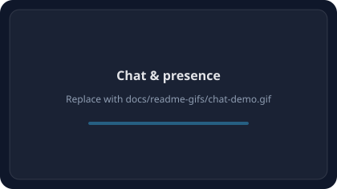
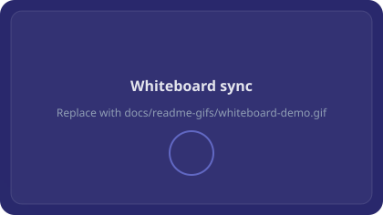

<!-- Glass-style hero + animated assets render on github.com; paths are relative to repo root. -->

<p align="center">
  
</p>

<p align="center">
  
</p>

<p align="center">
  
</p>

<p align="center">
  <a href="."></a>
  <a href="."></a>
  <a href="."></a>
</p>

<p align="center">
  
  
  
  
  
  
</p>

<p align="center">
  <a href="https://github.com/OWNER/REPO"></a>
  <a href="https://github.com/OWNER/REPO/graphs/contributors"></a>
  <a href="https://github.com/OWNER/REPO/commits"></a>
</p>

<p align="center"><sub>Replace every <code>OWNER/REPO</code> in this file with your GitHub user or org and repository name so stars, contributors, and last-commit badges resolve. Optional: add a <a href="https://hits.seeyoufarm.com">README hits</a> badge with your repo URL encoded in the query string.</sub></p>

# Connectly — Real-Time Multi-Room Communication Platform

> A distributed real-time system supporting multiple concurrent clients with synchronized shared state, collaborative tooling, and persistent data.

---
## Project Charter

| Field | Details |
| :--- | :--- |
| **Course** | CSCI 2020U |
| **Group** | 53 |
| **Product Name** | Connectly |
| **Members** | Dhruv Thakar, Ayush K., Aaryan Kulkarni |

---

## Overview

Connectly is a **real-time, multi-room communication platform** for many concurrent clients with synchronized shared state.

Beyond basic chat, it includes a **collaborative whiteboard**, **live presence**, **persistent messages and room data**, **file uploads**, and **JWT-based accounts**. Traffic is **event-driven** over **Socket.io**, with **Express** for REST and **SQLite** for structured persistence (users, rooms, messages, whiteboard strokes, pins). Additional **file-based** helpers under `server/utils` support uploads and legacy JSON data where applicable.

---

## Features

### Real-time multi-room chat

- Join or create rooms; messages broadcast over WebSockets to room members.
- History loaded from the server when joining a room.

### Live collaborative whiteboard

- Shared canvas; drawing events synchronized per room.
- Strokes persisted in SQLite for reload.

### Persistence

- **SQLite** (`server/data/connectly.sqlite` by default): users, rooms, messages, members, whiteboard strokes, room pins.
- **Uploads** served from `server/data/uploads` (static route `/uploads`).

### Presence and typing

- Active users per room, join/leave, typing indicators (via Socket.io).

### Files and pins

- Upload images/files in chat; metadata and links shared in real time.
- Pin attachments per room (API + UI).

### Authentication and roles

- **Sign up / login** with **bcrypt** password hashing and **JWT** sessions.
- **App roles** (`admin` / `moderator` / `user`) stored on the user record; Admin UI is gated for elevated roles.
- **Room roles**: first member in a room may be treated as room admin for that space (see server room logic).
- There is **no default admin account**. After signing up, promote a user in SQLite if needed, for example:  
  `UPDATE users SET role = 'admin' WHERE email = 'you@example.com';`  
  Then sign in again so the token reflects the new role.

### Landing and app shell

- Marketing-style **landing** with sections and navigation; authenticated **app** area with dashboard, chat, whiteboard, files, team, settings, and more.

---

## Showcase *(GIF layout)*

<p align="center">
  <strong>Drop screen recordings into <code>docs/readme-gifs/</code> and swap the <code>src</code> below, or keep the animated glass placeholders.</strong>
</p>

<table align="center">
  <tr>
    <td width="50%" align="center">
      <p><strong>Chat &amp; presence</strong></p>
      
      <p><sub>GIF: <code>docs/readme-gifs/chat-demo.gif</code></sub></p>
    </td>
    <td width="50%" align="center">
      <p><strong>Whiteboard sync</strong></p>
      
      <p><sub>GIF: <code>docs/readme-gifs/whiteboard-demo.gif</code></sub></p>
    </td>
  </tr>
</table>

<p align="center">
  
</p>

---

## Tech Stack

| Layer | Technology |
| :--- | :--- |
| **Frontend** | React 19, Vite 8, React Router 7, Tailwind CSS 4, Framer Motion, Zustand |
| **Backend** | Node.js, Express 5, Socket.io 4 |
| **Persistence** | SQLite (`sqlite` / `sqlite3`), local upload storage |
| **Auth** | JWT (`jsonwebtoken`), `bcryptjs` |

---

## System Architecture

```
Browsers  ←—— Socket.io (WebSocket) ——→  Node server (Express + Socket.io)
       ←—— REST (JSON) ——→                    │
                                              ├── SQLite (rooms, messages, users, …)
                                              └── disk (uploads, optional JSON helpers)
```

- **REST** handles auth, room CRUD, uploads listing, health check, and related endpoints.
- **Socket.io** handles chat, presence, typing, whiteboard sync, and real-time room events.
- The **Vite dev server** proxies nothing by default: the client calls the API using `src/config/serverUrl.js` (see **Environment** and **LAN access** below).

---

## Project structure

```
repo root/
├── assets/github-readme/    # README hero + animated SVG panels (glass theme)
├── docs/readme-gifs/        # Optional demo GIFs (see folder README)
├── src/                     # React app (Vite)
│   ├── components/          # UI + Connectly-specific components
│   ├── pages/               # Routes (chat, whiteboard, landing, auth, …)
│   ├── services/            # Socket client, API helpers
│   ├── contexts/            # Auth provider
│   ├── routes/              # Router, protected routes, role gates
│   ├── config/              # API base URL resolution (LAN-aware)
│   └── …
├── server/
│   ├── index.js             # Express app, auth routes, HTTP + Socket.io listen
│   ├── sockets/             # Socket.io handlers
│   ├── controllers/         # Room, file, whiteboard logic
│   ├── utils/               # DB init, file I/O
│   └── data/                # SQLite DB, uploads, optional JSON
├── public/
├── DOCS/                    # Architecture, testing, socket events, …
├── package.json             # Client scripts (root)
└── README.md
```

---

## Running locally

### Prerequisites

- **Node.js** (LTS recommended) and **npm**.

### 1. Clone and install

```bash
git clone <your-repo-url>
cd w26-csci2020u-finalproject-w26-team-18

npm install
cd server && npm install && cd ..
```

### 2. Environment (optional)

- Copy **`server/.env.example`** to **`server/.env`** and adjust `PORT`, `CLIENT_URL`, `JWT_SECRET`, `DB_PATH` as needed.
- For the client, copy **`.env.example`** to **`.env`** if you want to override API URL or port (see next section).

### 3. Start server and client

Use **two terminals** from the **repository root**:

```bash
# Terminal 1 — API + Socket.io (default port 3001; may auto-increment if busy)
cd server
npm run dev
```

```bash
# Terminal 2 — Vite (default http://localhost:5173, listens on all interfaces)
npm run dev
```

### 4. Open the app

- **This machine:** [http://localhost:5173](http://localhost:5173)
- **Health check:** [http://localhost:3001/health](http://localhost:3001/health) (replace port if the server printed a different one)

### Production build (client)

```bash
npm run build
npm run preview
```

Serve the `dist/` output behind your hosting of choice; set **`VITE_SERVER_URL`** at build time if the API lives on another origin.

---

## Environment variables

| Variable | Where | Purpose |
| :--- | :--- | :--- |
| `VITE_SERVER_URL` | Client `.env` | Full API origin (e.g. `https://api.example.com`). Overrides automatic hostname logic. |
| `VITE_SERVER_PORT` | Client `.env` | API port when inferring URL from the page hostname (default `3001`). |
| `PORT` | `server/.env` | HTTP/Socket.io port (default `3001`). |
| `CLIENT_URL` | `server/.env` | Primary browser origin for CORS (default `http://localhost:5173`). |
| `CORS_ORIGINS` | `server/.env` | Comma-separated extra allowed origins. |
| `JWT_SECRET` | `server/.env` | Secret for signing tokens (change in any shared deployment). |
| `DB_PATH` | `server/.env` | SQLite file path (default under `server/data/`). |
| `LAN_DEV` | `server/.env` | Set to `1` with `NODE_ENV=production` only if you intentionally need relaxed LAN CORS (avoid on public servers). |

See **`server/.env.example`** and **`.env.example`** in the repo for templates.

---

## LAN access (multiple laptops on the same Wi‑Fi)

1. Run the **server** and **`npm run dev`** on **one** computer (the host).
2. On the host, note the **LAN IPv4** address (e.g. `192.168.1.42` from `ipconfig` / `ifconfig`).
3. Other devices open **`http://<LAN-IP>:5173`** (not `localhost` on their machine).
4. The client defaults to **`http://<same-hostname-as-page>:<VITE_SERVER_PORT>`** for REST and Socket.io, so remote laptops hit the host API without editing code.
5. Allow **inbound** rules on the host firewall for the Vite port (**5173**) and API port (**3001** or the port shown in the server console).
6. The server listens on **all interfaces** (`0.0.0.0`) and logs suggested LAN URLs on startup.

If the API picks a **different port** (busy port), set **`VITE_SERVER_PORT`** in the root `.env` or set **`VITE_SERVER_URL`** to the full API URL and restart Vite.

---

## Documentation

Additional detail lives under **`DOCS/`**, including architecture, data schema, socket events, and testing notes.

---

## Future improvements

- [ ] **WebRTC** — voice and video between users.
- [ ] **Hosted database** — Postgres or managed DB for multi-instance deployments.
- [ ] **Cloud object storage** — S3-compatible storage for uploads.
- [ ] **Container deployment** — Docker Compose for repeatable local/prod setups.
- [ ] **Moderation** — fully wired kick/ban and audit logs where still prototype-only.

---

## Team

| Member | Role | Responsibilities |
| :--- | :--- | :--- |
| **Dhruv Thakar** | Server & Persistence Lead | Server architecture, persistence, multi-client handling |
| **Ayush K.** | Networking & Documentation Lead | Socket.io networking, README and documentation |
| **Aaryan Kulkarni** | Frontend & UX Lead | React UI, collaborative whiteboard, UX and sound effects |

---

## Team work contract

| Item | Agreement |
| :--- | :--- |
| **Communication** | Discord |
| **Meeting schedule** | Every Tuesday after lecture |
| **Conflict resolution** | If a member does not contribute to assigned tasks, the team will contact the instructor immediately. All members are responsible for enabling others to execute their work (for example pushing required code and updates on time). |

---

## Work division and contribution report

> **Note:** The *Actual Contribution* column must be updated at final submission.

| Task / Module | Assigned Member | Actual Contribution (Final) |
| :--- | :--- | :--- |
| **Multi-threaded Server** | Dhruv Thakar | *[To be completed at submission]* |
| **Socket Networking** | Ayush K. | *[To be completed at submission]* |
| **GUI Implementation** | Aaryan Kulkarni | *[To be completed at submission]* |
| **Persistence (File I/O)** | Dhruv Thakar | *[To be completed at submission]* |
| **UX / Sound Effects** | Aaryan Kulkarni | *[To be completed at submission]* |
| **Documentation / README** | Ayush K. | *[To be completed at submission]* |

---

## Final contribution status

> Tag one at final submission. Graders will use the *Actual Contribution* column above to apply uneven grades if applicable.

- [ ] **(1) EVEN CONTRIBUTION** — All members met expectations from the original charter.
- [ ] **(2) UNEVEN CONTRIBUTION** — One or more members did not meet expectations.
